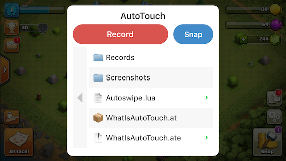
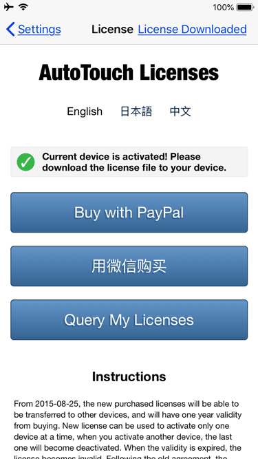

<h1 id="title">AutoTouch Documentation</h1>

`Applicable for v5.0.6 and above`

> - AutoTouch is a 'Macro' tool used to record and playback human-like inputs on an IOS device.
> - It is able simulate touch and key presses, through Lua scripting.
> - It has several extended functions to help you achieve automation.
> - It provides a Script Store to sell and buy scripts.
> - Requires a supported jailbroken device (jailbreaks on IOS 8 to IOS 12.1.2), uses [Lua 5.3.5](https://www.lua.org/manual/5.3/) <br>
>
> Normal releases can be found at http://apt.autotouch.net. Beta releases can be found at http://beta.autotouch.net
>
> Note: AutoTouch will also be referred to as 'AT' throughout this document.

<div class='md-toc' mdtype='toc'>
    <p class="md-toc-content">
    <span class="md-toc-item md-toc-h1"><a class="md-toc-inner" href="#title">AutoTouch Documentation</a></span>
    <span class="md-toc-item md-toc-h1"><a class="md-toc-inner" href="#install">Installation</a></span>
    <span class="md-toc-item md-toc-h1"><a class="md-toc-inner" href="#usage">Usage</a></span>
    <span class="md-toc-item md-toc-h2"><a class="md-toc-inner" href="#activatorusage">How do I use Activator with AutoTouch?</a></span>
    <span class="md-toc-item md-toc-h2"><a class="md-toc-inner" href="#scriptRecord">How do I record scripts?</a></span>
    <span class="md-toc-item md-toc-h2"><a class="md-toc-inner" href="#scriptPlayback">How do I play back a script?</a></span>
    <span class="md-toc-item md-toc-h2"><a class="md-toc-inner" href="#playSettings">How do I set play settings for script?</a></span>
    <span class="md-toc-item md-toc-h2"><a class="md-toc-inner" href="#screenshots">How do I take a screenshot?</a></span>
    <span class="md-toc-item md-toc-h2"><a class="md-toc-inner" href="#scriptWrite">How do I start writing scripts?</a></span>
    <span class="md-toc-item md-toc-h2"><a class="md-toc-inner" href="#funcHelper">How do I use the "Function Helper" while writing scripts?</a></span>
    <span class="md-toc-item md-toc-h2"><a class="md-toc-inner" href="#scriptWrite">How do I write and manage scripts on a computer?</a></span>
    <span class="md-toc-item md-toc-h2"><a class="md-toc-inner" href="#package">What is a package and how do I use it?</a></span>
    <span class="md-toc-item md-toc-h2"><a class="md-toc-inner" href="#encrypt">How do I encrypt scripts?</a></span>
    <span class="md-toc-item md-toc-h2"><a class="md-toc-inner" href="#store">How do you sell scripts in Script Store?</a></span>
    <span class="md-toc-item md-toc-h2"><a class="md-toc-inner" href="#buyScript">How do I download and buy scripts from Script Store?</a></span>
    <span class="md-toc-item md-toc-h2"><a class="md-toc-inner" href="#license">How do I buy a AutoTouch license?</a></span>
    <span class="md-toc-item md-toc-h1"><a class="md-toc-inner" href="#scripting">Scripting</a></span>
    <span class="md-toc-item md-toc-h2"><a class="md-toc-inner" href="#tuts">Basis</a></span>
    <span class="md-toc-item md-toc-h2"><a class="md-toc-inner" href="#devTools">Development Tools</a></span>
    <span class="md-toc-item md-toc-h2"><a class="md-toc-inner" href="#coord">Coordinate, Size and Orientation System</a></span>
    <span class="md-toc-item md-toc-h2"><a class="md-toc-inner" href="#extnLib">Extension Libraries</a></span>
    <!-- Extension libraries start -->
    <span class="md-toc-item md-toc-h3"><a class="md-toc-inner" href="#curl">Lua-cURL</a></span>
    <span class="md-toc-item md-toc-h3"><a class="md-toc-inner" href="#luaSocket">LuaSocket</a></span>
    <span class="md-toc-item md-toc-h3"><a class="md-toc-inner" href="#luaSec">LuaSec</a></span>
    <span class="md-toc-item md-toc-h3"><a class="md-toc-inner" href="#luaSqlite3">luaSqlite3</a></span>
    <span class="md-toc-item md-toc-h3"><a class="md-toc-inner" href="#luaFS">LuaFileSystem</a></span>
    <!-- Extension Libraries end -->
    <!-- Extension Functions start -->
    <span class="md-toc-item md-toc-h2"><a class="md-toc-inner" href="#extnFunc">Extension Functions</a></span>
    <span class="md-toc-item md-toc-h3"><a class="md-toc-inner" href="#touchDown">touchDown(id, x, y)</a></span>
    <span class="md-toc-item md-toc-h3"><a class="md-toc-inner" href="#touchUp">touchUp(id, x, y)</a></span>
    <span class="md-toc-item md-toc-h3"><a class="md-toc-inner" href="#tap">Tap(x, y)</a></span>
    <span class="md-toc-item md-toc-h3"><a class="md-toc-inner" href="#touchMove">touchMove(id, x, y)</a></span>
    <span class="md-toc-item md-toc-h3"><a class="md-toc-inner" href="#keyDown">keyDown(keyType)</a></span>
    <span class="md-toc-item md-toc-h3"><a class="md-toc-inner" href="#keyUp">keyUp(keyType)</a></span>
    <span class="md-toc-item md-toc-h3"><a class="md-toc-inner" href="#getColor">getColor(x, y)</a></span>
    <span class="md-toc-item md-toc-h3"><a class="md-toc-inner" href="#getColors">getColors(locations)</a></span>
    <span class="md-toc-item md-toc-h3"><a class="md-toc-inner" href="#findColor">findColor(color, count, region)</a></span>
    <span class="md-toc-item md-toc-h3"><a class="md-toc-inner" href="#findColors">findColors(colors, count, region)</a></span>
    <span class="md-toc-item md-toc-h3"><a class="md-toc-inner" href="#findImage">findImage(imagePath, count, fuzzy, ignoreColors, region)</a></span>
    <span class="md-toc-item md-toc-h3"><a class="md-toc-inner" href="#findImage2">findImage2(targetImagePath, targetsToFind)</a></span>
    <span class="md-toc-item md-toc-h3"><a class="md-toc-inner" href="#screenshot">screenshot(filePath, region)</a></span>
    <span class="md-toc-item md-toc-h3"><a class="md-toc-inner" href="#appRun">appRun(appIdentifier)</a></span>
    <span class="md-toc-item md-toc-h3"><a class="md-toc-inner" href="#appKill">appKill(appIdentifier)</a></span>
    <span class="md-toc-item md-toc-h3"><a class="md-toc-inner" href="#appState">appState(appIdentifier)</a></span>
    <span class="md-toc-item md-toc-h3"><a class="md-toc-inner" href="#rootDir">rootDir()</a></span>
    <span class="md-toc-item md-toc-h3"><a class="md-toc-inner" href="#usleep">usleep(microseconds)</a></span>
    <span class="md-toc-item md-toc-h3"><a class="md-toc-inner" href="#log">log(content)</a></span>
    <span class="md-toc-item md-toc-h3"><a class="md-toc-inner" href="#alert">alert(message)</a></span>
    <span class="md-toc-item md-toc-h3"><a class="md-toc-inner" href="#toast">toast(message, delay)</a></span>
    <span class="md-toc-item md-toc-h3"><a class="md-toc-inner" href="#vibrate">vibrate()</a></span>
    <span class="md-toc-item md-toc-h3"><a class="md-toc-inner" href="#playAudio">playAudio(audioFile, times)</a></span>
    <span class="md-toc-item md-toc-h3"><a class="md-toc-inner" href="#stopAudio">stopAudio()</a></span>
    <span class="md-toc-item md-toc-h3"><a class="md-toc-inner" href="#getOrientation">getOrientation()</a></span>
    <span class="md-toc-item md-toc-h3"><a class="md-toc-inner" href="#getScreenResolution">getScreenResolution()</a></span>
    <span class="md-toc-item md-toc-h3"><a class="md-toc-inner" href="#getSN">getSN()</a></span>
    <span class="md-toc-item md-toc-h3"><a class="md-toc-inner" href="#getVersion">getVersion()</a></span>
    <span class="md-toc-item md-toc-h3"><a class="md-toc-inner" href="#intToRgb">intToRgb(intColor)</a></span>
    <span class="md-toc-item md-toc-h3"><a class="md-toc-inner" href="#rgbToInt">rgbToInt(r, g, b)</a></span>
    <span class="md-toc-item md-toc-h3"><a class="md-toc-inner" href="#copyText">copyText(text)</a></span>
    <span class="md-toc-item md-toc-h3"><a class="md-toc-inner" href="#clipText">clipText()</a></span>
    <span class="md-toc-item md-toc-h3"><a class="md-toc-inner" href="#inputText">inputText(text)</a></span>
    <span class="md-toc-item md-toc-h3"><a class="md-toc-inner" href="#dialog">dialog(controls, enableRemember)</a></span>
    <span class="md-toc-item md-toc-h3"><a class="md-toc-inner" href="#clearDialogValues">clearDialogValues(script)</a></span>
    <span class="md-toc-item md-toc-h3"><a class="md-toc-inner" href="#openURL">openURL(urlString)</a></span>
    <span class="md-toc-item md-toc-h3"><a class="md-toc-inner" href="#license">isLicensed()</a></span>
    <!-- Extension Functions End -->
    <!-- HTTP API's start -->
    <span class="md-toc-item md-toc-h3"><a class="md-toc-inner" href="#playScript">Play a script</a></span>
    <span class="md-toc-item md-toc-h3"><a class="md-toc-inner" href="#stopScript">Stop playing a script</a></span>
    <span class="md-toc-item md-toc-h3"><a class="md-toc-inner" href="#listDir">List files in directory</a></span>
    <span class="md-toc-item md-toc-h3"><a class="md-toc-inner" href="#newDir">Create a new directory</a></span>
    <span class="md-toc-item md-toc-h3"><a class="md-toc-inner" href="#newFile">Create a new file</a></span>
    <span class="md-toc-item md-toc-h3"><a class="md-toc-inner" href="#delFile">Delete a file</a></span>
    <span class="md-toc-item md-toc-h3"><a class="md-toc-inner" href="#rename">Rename a file or directory</a></span>
    <!-- HTTP API's end -->
    <span class="md-toc-item md-toc-h2"><a class="md-toc-inner" href="#constants">Some Constants</a></span>
    <span class="md-toc-item md-toc-h3"><a class="md-toc-inner" href="#physicalKeys">Types of physical keys</a></span>
    <span class="md-toc-item md-toc-h3"><a class="md-toc-inner" href="#dialogControls">Types of dialog controls</a></span>
    <span class="md-toc-item md-toc-h3"><a class="md-toc-inner" href="#screenOrientation">Types of screen orientations</a></span></p>
</div>


<h1 id="install">Installation</h1>

> - You can search and install AutoTouch in Cydia directly from the BigBoss repo.
> - You can also add the official repo: http://apt.autotouch.net to Cydia and install AutoTouch there.
> - There is also a beta repo: http://beta.autotouch.net which has in-progress builds that can be unstable but features are developed much faster
>
> If you are experiencing issues with AutoTouch please first check for updates in Cydia and see if this remedies your issue(s).


<h1 id="usage">Usage</h1>

<h2 id="activatorusage">How do I use Activator with AutoTouch? (depends on IOS compatibility)</h2>

> - By default the AutoTouch menu pops up when the volume down button is held. This default behavior can changed by installing Activator.
>
> - Add the official repo: http://rpetri.ch/repo/ to Cydia. Activator may not support your version of IOS properly, so make sure to check with others. 
>
>   *(Jailbreaking discord is a suitable place to ask: https://discord.gg/bHdzaab)*
>
> - Install Activator from that repo.
>
> - AutoTouch will automatically detect Activator and use it as the default control method. From there you can set what actions will bring up the AutoTouch control panel.

<h2 id="scriptRecord">How do I record scripts?</h2>

> 1. Bring up the AutoTouch control panel by using your chosen activation method 
>
>   *Default is to hold the volume down unless you changed it with the Activator tweak.*
>   
>
> 2. Press the "Record" button to start recording.
>
> 3. All touch and key inputs will be recorded into a script.
>
> 4. Hold on volume decrease button (or chosen Activator method) again to stop the recording.
>
> 5. Then, there will be a Lua script named with create time in the script list. You can edit, rename or play it back.
>
> ```sequence
> Common state->Control panel: Hold volume button
> Control panel->Recording: Click on 'Record'
> Recording-->Common state: Hold volume down button again
> ```
>
> 

<h2 id="scriptPlayback">How do I play back scripts?</h2>

> 1. Use your chosen activation method to bring up the AutoTouch control panel.
> 2. Click the script you want to run.
> 3. The dialog for playback settings will pop up to determine the number of repeats, interval, and speed of the script. This can be bypassed by setting the script to "play directly" within the AutoTouch app itself 
>
> <video width="300" autoplay muted playsinline loop preload="metadata"><source src="video\Script_Play_example.mp4"></video>
>
> 
>
> 4. Press the "Play" button on play settings dialog to play immediately.
> 5. If you press the "Hold" button, it will enter the "Ready to play" status, which every time you quick press the volume down button, the script play back once based on the settings you provided it in the previous modal. 
> 6. Hold volume decrease button to forcibly stop the script playback, or quit the "Ready to play" status.
>
> ```sequence
> Common state->Control panel: Hold volume button
> Control panel->Play settings: Select a script to play
> Play settings->Ready to play state: Click the 'Hold' button
> Ready to play state->Playing: Press volume button
> Playing-->Ready to play state: Press volume button again
> Play settings->Playing: Click the "Play" button
> Playing-->Common state: Hold volume button
> ```
>
> 

<h2 id="playSettings">How do change 'play settings' for scripts?</h2>

> - You can set an Activator action to trigger a script directly.
>
> - Additionally you turn on "play directly" to skip the play settings dialog while playing.
>
> 

<h2 id="screenshots">How do I take screenshots?</h2>

> 1. Press “Snap” button on the AutoTouch control panel to take screenshot.
> 2. The screenshot will be saved as 32-bit BMP image in the 'Screenshots' folder, which can be used to specify parameters of [getColors](#getColors), [findColors](#findColors) or [findImage](#findImage) and more in your scripts. AutoTouch needs image files to be in this format for most operations.
>
> Alternatively you may also use the [screenshots function](#screenshot) to capture a screenshot via a script

<h2 id="scriptWrite">How do I start writing scripts?</h2>

> - From within the AutoTouch app, press "+" button at the top right, choose “Create a script” to open the script editor.
> - Start writing Lua code!
> - Press "save" button to save the script.
>
> <video width="300" autoplay loop muted playsinline preload="metadata"><source src="video\Script_Creation_example.mp4"></video>

<h2 id="funcHelper">How do I use the "Function Helper" while writing scripts?</h2>

> - There are "Extensions", "Indent" and "Statements" buttons on top of the keyboard in the script editor. You can conveniently insert extended functions, indent or common statement of Lua Language.
> - Press the "Extension" button to be presented with the extended functions list, click a function to insert into the script.
> - Press the "HELPER" button on the function list, it will help you to determine the coordinates, colors or key flags for the functions.
>
<div class="row">
    <div class="column">
        <figure>
            
            <figcaption>1 of 4</figcaption>
        </figure>
    </div>
    <div class="column">
        <figure>
            
            <figcaption>2 of 4</figcaption>
        </figure>
    </div>
    <div class="column">
        <figure>
            
            <figcaption>3 of 4</figcaption>
        </figure>
    </div>
    <div class="column">
        <figure>
            
            <figcaption>4 of 4</figcaption>
        </figure>
    </div>
</div>
<h2 id="scriptWrite">How do I write and manage scripts on a computer?</h2>s

> - Turn on the Web Server in AutoTouch settings and visit the URL that appears just below,on you preferred browser. You can manage scripts remotely from there.
> - You can also turn on WebDAV Server and connect the told address with WebDAV client on computer. 

<h2 id="package">What is a package and how do I use it?</h2>

> - You can create a package as sort of script project/folder that will contain different scripts, files and images etc. Packages must have a `main.lua` file which will be run first when executing it through AutoTouch. A package is like a zip file and also support encryption, they are named with `.at` extension i.e `myFirstPackage.at`.
> - Package can be encrypted to xxx.ate which is also execuate-able and can be released to Script Store.

<h2 id="encrypt">How do I encrypt scripts?</h2>

> 1. Tap accessory button of a package or script in the local script list, choose "Encrypt".
> 2. Input the encryption password or leave it blank if you do not want one.
> 3. Press "Confirm" to complete the encryption. A encrypted file with the same name but ended with .lua.e or .ate will be generated in the script list then.
> 4. You can play the encrypted scripts, or release them to Script Store.

<h2 id="store">How do I sell scripts on the store?</h2>

> 1. Visit https://autotouch.net/server/login.php from browser on computer.
> 2. Complete the details required to create a new script. 
> 3. Create a detailed description and nice looking mobile suitable html page for the script, a YouTube video embeded within the page is preferred.
> 4. Upload a encrypted script or package as a new version to this script.
> 5. Wait for approval.
> 6. You should setup the Digital Rights Management in the script by yourself, AutoTouch Script Store can not help you with that currently.
>
> Note: low-effort/recorded scripts will not be accepted please make sure they add something unique!

<h2 id="buyScript">How do I download and buy scripts from Script Store?</h2>

> - You can directly download scripts from the store within the AutoTouch app.
> - You need to contact the author to buy the decryption password. Take care with the transaction,all effort is made to ensure on high quality scripts are uploaded but AutoTouch cannot prevent an author from scamming you, so take care with the payment. Any abuse will lead to a ban from the platform.

<h2 id="license">How do I buy a AutoTouch license? </h2>

> 1. Tap License on AutoTouch settings to enter the license management view.
> 2. Read the instructions and do be aware that AutoTouch license has a <u>**ONE YEAR**</u> validity period!
> 3. It will automatically activate current device after the payment if you use PayPal (If failed just follow the next step).
> 4. You can query bought licenses with your PayPal ID email, or any activated device SN.
> 5. You can activate another device with a license after you query it out.
> 6. You can also "Activate Current Device" diretly with a license key bought from other devices.
> 7. You should make sure it shows "License Downloaded" at top-right of the License view after it is activated.
> 8. It allows only one time activation a day, you may do it again after 24 hours if you need.
> 
>

<h1 id="scripting">Scripting </h1>

<h2 id="tuts">References and Tutorials</h2>

You can learn how to use Lua language from here:《[Lua Official Reference Manual](http://www.lua.org/manual/5.3/)》

For further reading consider:

- [Programming in Lua](https://www.lua.org/pil/) - By purchasing these books your money goes straight to supporting the developers of [Lua](https://www.lua.org) and if you purchase the e-book it comes as DRM free 
- [Lua-wiki Tutorial](http://lua-users.org/wiki/LuaTutorial) - Moderate intro to lua, for people somewhat comfortable with programming concepts already
- [Lua Crash Course](http://luatut.com/crash_course.html) - Course that runs through everything at a very fast pace, you wont understand much at first, slightly technical
- [Tutorialspoint - Lua Course](https://www.tutorialspoint.com/lua/) - Free, self contained Lua course for beginners, recommended. The content itself is a bit bland due to a lack of colors or pictures but stick with it
- [LÖVE - Lua game engine](https://love2d.org/) - LÖVE is an *awesome* framework you can use to make 2D games in Lua. It's free, open-source, and works on Windows, Mac OS X, Linux, Android and iOS.

<h2 id="devTools">Development Tools</h2>

 [ZeroBrane Studio](https://studio.zerobrane.com/) is a lightweight free/pay what you want open-source Lua IDE with code completion, syntax highlighting, code analyzer, live coding, and debugging support for Lua 5.1, Lua 5.2, Lua 5.3, LuaJIT, and other Lua engines.

> A user created a ZeroBrane plugin that integrates all AutoTouch functions, autocomplete and definitions lookup. Get it [here](https://github.com/Xamanthas/AT_ZBS-API)

---

[LuaStudio](http://luastudio.net/) is a professional development environment for debugging Lua script in your applications. It's quite fast but is only based on Lua 5.2 whilst AutoTouch now uses Lua 5.3. The site periodically goes down, not recommended.

---

[AutoMainPNG](https://plaza.rakuten.co.jp/cocoab/) - JP/Eng *(English is little hard to understand)* paid scripting editor made specifically for AutoTouch. Costs money to unlock further features, pretty great idea for scripting noobs but needs clearer translation.

<h2 id="coord">Coordinate, Size and Orientation System</h2>

AutoTouch uses pixel based Native Resolution as the coordinate and size system. Resolutions of different iOS devices are [here](https://developer.apple.com/library/archive/documentation/DeviceInformation/Reference/iOSDeviceCompatibility/Displays/Displays.html) however Apple has not updated it since 2017. 

> For example: The screen size of iPhone X is 1125 x 2436.

Origin point (0, 0) is always at the top left of the **Application Interface**, regardless of the device orientation. This concept is used in these functions: 

- Touch emulation:
  - touchDown,touchMove,touchUp,
- Return color values of x, y cordinates:
  - getColor, getColors
- Find specified color values:
  - findColor, findColors
- Find a match to a specified image:
  - findImage, findImage2


<h2 id="extnLib">Extension Libraries</h2>

AutoTouch has some extension libraries built in, while you can also add these libraries by yourself, just place`.so` files at `/usr/local/lib/lua/5.3` and `.lua` files at `/var/mobile/Library/AutoTouch/Library/LuaLibraries`.

**Warning:** **DO NOT** use script filename same as the libraries’ name, such as `lcurl`, `lfs`, `lsqlite3`

<h3 id="curl">Lua-cURL</h3>

cURL is a command-line tool for getting or sending data including files using [URL](https://en.wikipedia.org/wiki/URL) syntax. It supports communicating with HTTP, HTTPS, FTPS, and many, many [more](https://curl.haxx.se/).

AT implements Lua-cURL V3 for cURL support.

[Documentation](https://lua-curl.github.io/lcurl/modules/cURL.html)

[Github project](https://github.com/Lua-cURL/Lua-cURLv3)

`Examples`

```lua
-- HTTP Get
local curl = require('lcurl')
curl.easy{
    url = 'http://httpbin.org/get',
    httpheader = {
      "X-Test-Header1: Header-Data1",
      "X-Test-Header2: Header-Data2",
    },
    writefunction = alert -- use io.stderr:write()
  }
  :perform()
:close()

-- HTTP Post
curl.easy()
  :setopt_url('http://posttestserver.com/post.php')
  :setopt_writefunction(io.write)
  :setopt_httppost(curl.form() -- Lua-cURL guarantee that form will be alive
    :add_content("test_content", "some data", {
      "MyHeader: SomeValue"
    })
    :add_buffer("test_file", "filename", "text data", "text/plain", {
      "Description: my file description"
    })
    :add_file("test_file2", "BuildLog.htm", "application/octet-stream", {
      "Description: my file description"
    })
  )
  :perform()
:close()
```

<h3 id="luaSocket">LuaSocket</h3>

LuaSocket is a Lua extension library which supported [TCP](http://w3.impa.br/~diego/software/luasocket/introduction.html#tcp), [UDP](http://w3.impa.br/~diego/software/luasocket/introduction.html#udp), [SMTP](http://w3.impa.br/~diego/software/luasocket/smtp.html), [HTTP](http://w3.impa.br/~diego/software/luasocket/http.html), [FTP](http://w3.impa.br/~diego/software/luasocket/ftp.html) protocols. Learn how to use it from here](http://w3.impa.br/~diego/software/luasocket/introduction.html).

<h3 id="luaSec">LuaSec</h3>

LuaSec is a binding for OpenSSL library to provide TLS/SSL communication. It takes an already established TCP connection and creates a secure session between the peers. [Learn More](https://github.com/brunoos/luasec/wiki)

<h3 id="luaSqlite3">LuaSqlite3</h3>

LuaSQLite 3 is a thin wrapper around the public domain SQLite3 database engine. [Learn More](http://lua.sqlite.org/index.cgi/doc/tip/doc/lsqlite3.wiki)

`Examples`

```sqlite
local sqlite3 = require("lsqlite3")

local db = sqlite3.open_memory()

db:exec[[
  CREATE TABLE test (id INTEGER PRIMARY KEY, content);

  INSERT INTO test VALUES (NULL, 'Hello World');
  INSERT INTO test VALUES (NULL, 'Hello Lua');
  INSERT INTO test VALUES (NULL, 'Hello Sqlite3')
]]

for row in db:nrows("SELECT * FROM test") do
  log(row.content)
end
```

<h3 id="luaFS">LuaFileSystem</h3>

LuaFileSystem is a Lua library developed to complement the set of functions related to file systems offered by the standard Lua distribution. It offers a portable way to access the underlying directory structure and file attributes.[Learn More](https://keplerproject.github.io/luafilesystem/manual.html)

<h2 id="extnFunc">Extension Functions</h2>

Extension functions are used to extend Lua language. With these the device can simulate most human inputs and also achieve automation. Some of these are: screenshot, color searching, color matching, and picture matching.

<h3 id="touchDown">touchDown(id, x, y)</h3>

    Presses a coordinate (x,y) on the screen.

`Parameters`

| Parameter     | Type   |  Specification  |
| -------- | :-----:| ----  |
| id    | Integer   |  Finger ID. Used to mark a finger in single-touch or multi-touch. |
| x     |   Float   |   x-coordinate on the screen   |
| y     |    Float    |  y-coordinate on the screen  |

`Return`
None

`Examples`
```lua
-- Press by one finger at coordinate (100,200).
touchDown(0, 100, 200); 

-- Press by three fingers at three locations on the screen.
touchDown(0, 100, 200);
touchDown(1, 200, 300);
touchDown(2, 300, 400);

-- Implement a tap function
function tap(x, y)
    touchDown(0, x, y);
    usleep(16000);
    touchUp(0, x, y);
end

-- Tap at (100, 200)
tap(100, 200);

```

<h3 id="touchUp">touchUp(id, x, y)</h3>

    Lift the finger from coordinate (x,y)

`Parameters`

| Parameter     | Type   |  Specification  |
| -------- | :-----:| ----  |
| id    | Integer   |  Finger ID. Used to mark a finger in single-touch or multi-touch. |
| x     |   Float   |   x-coordinate on the screen   |
| y     |    Float    |  y-coordinate on the screen  |

`Return`
None

`Examples`
```lua
-- Click the screen with one finger at coordinate (100,200).
touchDown(0, 100, 200);
usleep(16000);
touchUp(0, 100, 200);

-- Press by three fingers at three locations on the screen, move to new location, and then lift the finger.
touchDown(0, 100, 200);
touchDown(1, 200, 300);
touchDown(2, 300, 400);
usleep(16000);
touchMove(0, 150, 250);
touchMove(1, 250, 350);
touchMove(2, 350, 450);
usleep(16000);
touchUp(0, 150, 250);
touchUp(1, 250, 350);
touchUp(2, 350, 450);
```

<h3 id="tap">tap(x, y)</h3>

```Taps with a single finger on the specified coordinate. ```

`Parameters`

| Parameter | Type  | Specification              |
| :-------- | :---: | -------------------------- |
| x         | Float | x-coordinate on the screen |
| y         | Float | y-coordinate on the screen |

`Return`
None

`Note:`  Tap has far less control due to its simplicity and has no built in randomness. It is recommended to overwrite tap when used in games as it easily detected as the length of the 'finger press' will always be the same
`Examples`

```lua
--Example 1: Quickly taps once on the screen
tap(300, 435);
usleep(20000);

--Example 2: Uses findColors (discussed later) to look for a particular app icon on the home screen, logs it then taps the resulting co-ordinates. These sorts of cases are where its okay to use the unmodified tap function. In games its too easy to detect
local result = findColors({{3380451,0,0}, {16777215,1,0}, {9160301,6,0}, {3380451,-2,0}, {14133291,6,45}, {16764976,8,49}, {14556453,35,82}, {228316,-7,76}}, 0, nil);;
for i, v in pairs(result) do
	log(string.format("Found the app at: x:%f, y:%f", v[1], v[2]));
	log(getColor(v[1], v[2]));
	tap(v[1], v[2]);
end
```

<h3 id="touchMove">touchMove(id, x, y)</h3>

    Move the finger to coordinate (x,y).

`Parameters`

| Parameter     | Type   |  Specification  |
| -------- | :-----:| ----  |
| id    | Integer   |   Finger ID. is used to mark a finger in single-touch or multi-touch. |
| x     |   Float   |   x-coordinate on the screen   |
| y     |    Float    |  y-coordinate on the screen  |

`Return`
None

`Examples`
```lua
-- Press one finger at coordinate (100,200) and move the finger to coordinate (200,200).
touchDown(0, 100, 200);
usleep(16000);
touchMove(0, 200, 200);

-- Press three fingers at three locations on the screen and move to new location.
touchDown(0, 100, 200);
touchDown(1, 200, 300);
touchDown(2, 300, 400);
usleep(16000);
touchMove(0, 150, 250);
touchMove(1, 250, 350);
touchMove(2, 350, 450);

```

<h3 id="keyDown">keyDown(keyType)</h3>

    Simulate the pressing of physical key.

`Parameters`

| Parameter     | Type   |  Specification  |
| -------- | :-----:| ----  |
| keyType     |   Integer   |   Physical key identification. Now you can use [these physical keys](#types-of-physical-keys).   |

`Return`
None

`Examples`
```lua
-- Simulate the pressing of Home Key.
keyDown(KEY_TYPE.HOME_BUTTON);

-- How to simulate a key pressing?
function keyPress(keyType)
    keyDown(keyType);
    usleep(10000);
    keyDown(keyUp);
end
keyPress(KEY_TYPE.HOME_BUTTON);

-- How to simulate a screen lock function?
function lockScreen()
    keyDown(KEY_TYPE.POWER_BUTTON);
    keyUp(KEY_TYPE.POWER_BUTTON);
end
```

<h3 id="keyUp">keyUp(keyType)</h3>

    Simulate the lifting of physical key.

`Parameters`

| Parameter     | Type   |  Specification  |
| -------- | :-----:| ----  |
| keyType     |   Integer   |   Physical key identification. Now you can use [these physical keys](#types-of-physical-keys).   |

`Return`
None

`Examples`

```lua
-- Simulate the action of pressing and lifting Home Key.
keyDown(KEY_TYPE.HOME_BUTTON);
usleep(10000);
keyUp(KEY_TYPE.HOME_BUTTON);
```

<h3 id="getColor">getColor(x, y)</h3>

    Get the color value of the pixel point at the specified coordinate.

`Parameters`

| Parameter     | Type   |  Specification  |
| -------- | :-----:| ----  |
| x     |   Float   |   x-coordinate on the screen   |
| y     |    Float    |  y-coordinate on the screen  |

`Return`
| Return     | Type   |  Specification  |
| -------- | :-----:| ----  |
| color     |   Integer   |   Integer color value of the pixel point   |

`Examples`
```lua
local color = getColor(100, 200);
alert(string.format("Pixel color is :%d", color));
-- Pop up color: 16777215
```

<h3 id="getColors">getColors(locations)</h3>

    Get the color values of the pixel points of the specified coordinates on current screen.

`Parameters`

| Parameter     | Type   |  Specification  |
| -------- | :-----:| ----  |
| locations     |   table   |   A group of coordinates specifying the points you want to return the color from i.e {{x1,y1},{x2,y2},{x3,y4}}   |

`Return`
| Return     | Type   |  Specification  |
| -------- | :-----:| ----  |
| colors     |   table   |  Colors found are returned in their corresponding order.  |

`Examples`

```lua
local result = getColors({{100, 200}, {200, 300}, {300, 400}});
for i, v in pairs(result) do
    log(string.format("Gotten color:%d", v));
end
```

<h3 id="findColor">findColor(color, count, region)</h3>

    Search the coordinates of the pixel points matching the specified color on current screen.

`Parameters`

| Parameter     | Type   |  Specification  |
| -------- | :-----:| ----  |
| color     |   Integer   |   Matched color value.   |
| count     |   Integer    | The number refers to how many matched pixel points is required for a match. 0 is default setting, which requires all points match (slowest option). 1 refers to only the first matching pixel point is found. 2 refers to only the first two pixel points are found. The lower the number is (above zero), the faster the speed is. |
| region     |   table    | You only search the result in the specified area. This area is the table type including four values {x, y, width, height}. The four values respectively represent the coordinate x, coordinate y, width, and height of the rectangular area. {100,100,200,200} is an example. If you do not want to specify the area, just input nil.  |

`Return values`
| Return value     | Type  |  Specification  |
| -------- | :-----:| ----  |
| locations     |   table   |  Coordinates of matched pixel points. For example: {{x1, y1}, {x2, y2}, ...}  |

`Example`
```lua
-- Example 1:
local result = findColor(0x0000ff, 2, nil);
for i, v in pairs(result) do
    log(string.format("Found pixel: x:%f, y:%f", v[1], v[2]));
end

-- Example 2:
local result = findColor(0x00ddff, 0, {100, 50, 200, 200});
for i, v in pairs(result) do
    log(string.format("Found pixel: x:%f, y:%f", v[1], v[2]));
end

-- Example 3:
local region = {100, 50, 200, 200};
local result = findColor(0x00ddff, 0, region);
for i, v in pairs(result) do
    log(string.format("Found pixel: x:%f, y:%f", v[1], v[2]));
end
```

`Internal Implementation`
```lua
function findColor(color, count, region)
    return findColors({{color,0,0}}, count, region);
end
```

<h3 id="findColors">findColors(colors, count, region)</h3>

Searches a region for specified colors and their position relative to the other colors matches. If a match is found it returns the coordinate of the matching first color.

This function has the search efficiency far beyond findImage. For example, you do not need to match the whole picture, only the anchor colors and their corresponding location. 

You can specify the number of the results by count parameter. 0 refers to all, 1 refers to the first one, and 2 refers to the first tow. region parameter can specify the search area, which is the table type {x,y,width, height}. You only input nil if no data is specified. The more points you specify to match, the higher the accuracy.

This function can use the 'HELPER' tool in the 'Extension' menu. Select the anchors’ colors in a selected bmp and the tool will supply the corresponding location and color to the function’s parameter automatically.

In the below image, the table highlighted is the coordinate that will be returned upon a match.


`Parameters`

| Parameter| Type   |  Specification  |
| -------- | :-----:| ----  |
| colors     |   table   |  Include color and their corresponding location, such as: `{{0x00ddff,0,0}, {0x00eeff,10,10}, {0x0000ff,0,20}}`. The inner tables includes 3 separate values: the 1st is the color value, the 2nd and 3rd are the x & y coordinates respectively. The corresponding location of the first color’s table is always (0,0) due to it being the origin point from which other coordinates are calculated. `{0x00ddff,0,0}` is an example. The anchor points are calculated relative to the first point.  |
| count     |   Integer    | The number refers to how many matched pixel points are required to be found before a match is declared. 0 is default setting, which requires all matching points to be found. 1 requires only 1 matching point to be found and so forth. The lower the count (above zero), the faster the script will resolve. |
| region     |   table    | Specify the search region. This area is the table type that includes four values {x, y, width, height}. The four values represent the coordinate x, coordinate y, width, and height of the rectangular area.  If you do not want to specify the area, just input `nil`. |

`Return values`

| Return value     | Type  |  Specification  |
| -------- | :-----:| ----  |
| locations     |   table   |  The coordinate of the first color matched in the found rectangular area, including {{x1, y1}, {x2, y2}, ...}  |

`Examples`
```lua
-- Example 1:
local result = findColors({{0x00ddff,0,0}, {0x00eeff,10,10}, {0x0000ff,0,20}}, 2, nil);
for i, v in pairs(result) do
    log(string.format("Found rect at: x:%f, y:%f", v[1], v[2]));
end

-- Example 2:
local colors = {{0x00ddff,0,0}, {0x00eeff,10,10}, {0x0000ff,0,20}};
local result = findColors(colors, 0, nil);
for i, v in pairs(result) do
    log(string.format("Found rect at: x:%f, y:%f", v[1], v[2]));
end

-- Example 3:
local colors = {{0x00ddff,0,0}, {0x00eeff,10,10}, {0x0000ff,0,20}};
local region = {100, 50, 200, 200};
local result = findColors(colors, 0, region);
for i, v in pairs(result) do
    log(string.format("Found match at: x:%f, y:%f", v[1], v[2]));
    tap(v[1], v[2]);
end
```

<h3 id="findImage">findImage(imagePath, count, fuzzy, ignoreColors, region, debug) </h3>

    Searches the region specified for a match with the provided image and if a match is found returns the coordinate of the top left corner of the matched image


`Parameters`

| Parameter       |  Type   | Specification                                                | Optional |   Default    |
| --------------- | :-----: | ------------------------------------------------------------ | :------: | :----------: |
| targetImagePath | String  | Relative path of the target image to match, for example: “Screenshots/gold.PNG”. Any valid format of images are supported. |    NO    |              |
| count           | integer | How many matches of the given image you would like to find on-screen. Pass nil if you just want to use the default value. |   YES    |      1       |
| threshold       |  float  | Searching precision, maximum value is 1 means every anchor point must match exactly, minimum value is 0.2 default is 0.9, usually 0.99 is good. Pass nil if you just want to use the default value. |   YES    |     0.9      |
| region          |  table  | You only search the result in the specified area. This area is the table type including four values {x, y, width, height}. The four values respectively represent the coordinate x, coordinate y, width, and height of the rectangular area. Pass nil if you just want to use the default value |   YES    | Whole screen |
| debug           | boolean | If pass debug=true, it will produce a image ends with “-Debug.PNG” in same directory as the target image is, marked with matched areas. |   YES    |    false     |

`Return values`

| Return value     | Type  |  Specification  |
| -------- | :-----:| ----  |
| locations     |   table   |  The array at the coordinate on the center of the matched area(s): {{x1, y1}, {x2, y2}, ...}  |

`Examples`

```lua
-- Example 1:
local result = findImage("Screenshots/Gold.PNG", 5, 0.99, nil, true)
for i, v in pairs(result) do
    log(string.format("Found rect at: x:%f, y:%f", v[1], v[2]));
end

-- Example 2:
local result = findImage("Screenshots/Gold.PNG", nil, nil, nil, true)
for i, v in pairs(result) do
    log(string.format("Found rect at: x:%f, y:%f", v[1], v[2]));
end

-- Example 3:
local result = findImage("Screenshots/Gold.PNG", 3)
for i, v in pairs(result) do
    log(string.format("Found rect at: x:%f, y:%f", v[1], v[2]));
end

-- Example 4:
local imagePath = "images/spirit.PNG";
local region = {100, 100, 300, 300};
local result = findImage(imagePath, 2, 0.98, region, true)
for i, v in pairs(result) do
    local x = v[1], y = v[2];

    log(string.format("Found rect at: x:%f, y:%f", x, y));
    
    -- Click the found location once.
    tap(x, y);
    usleep(16000);
end
```

<h3 id="findImage2">findImage2(targetImagePath, targetsToFind) </h3>

`Searches the entire screen for a match to the specified image, it is able to deal with most image size, orientation and color changes intelligently. `

FindImage2 is a powerful successor to findImage allowing you to search for matches in very dynamic applications and games. However these features do come with a performance hit, in most cases it *will* be slower, so you should take care and only use when the powerful features are needed 

`Parameters`

| Parameter                |  Type   | Specification                                                |
| ------------------------ | :-----: | ------------------------------------------------------------ |
| imagePath                | String  | The path of the picture, only the subfolders need to be specified if it sits somewhere within the AutoTouch directory. For example, `images/script.bmp` means `/var/mobile/Library/AutoTouch/Scripts/images/spirit.bmp`. You need not input the complete path.<br /> Accepts **only** 32-bit `.bmp` & `.png` |
| targetsToFind (optional) | Integer | findImage2 handles matching differently. It will only determine a proper match, there is no 'fuzziness'. As such a new parameter called `targetsToFind` controls how many proper matches you want to return. For example: If there are 5 identical footballs on the screen, with the same image provided to the path and you have set `targetsToFind`= 5, then the function will return the coordinates of the 5 matches |

`Return values`

| Return value | Type  | Specification                                                |
| ------------ | :---: | ------------------------------------------------------------ |
| locations    | table | The array will be at the center of the matching area: {{x1, y1}, {x2, y2}, ...} |

<h3 id="screenshot">screenshot(filePath, region) </h3>

    Take a screenshot for the whole screen or specified area and save as 32-bit BMP format at specified file path.

`Parameters`

| Parameter     | Type   |  Specification  |
| -------- | :-----:| ----  |
| filePath     |   string   | The path of screenshot. From AutoTouch v3.1.1, you only input the location subordinated to AutoTouch file directory, namely, the path of “Local Script”. (you can get the path of the file directory by rootDir function). For example, “images/script.bmp” means “/var/mobile/Library/AutoTouch/Scripts/images/spirit.bmp”. You need not input the complete path. |
| region     |   table    | Define the region to take the screenshot with. This area is a table type including four values {x, y, width, height}. {100,100,200,200} is an example. If you do not want to specify the area, just input nil. |

`Return values`
None

`Examples`
```lua
-- Take a screenshot of the whole screen and save in the specified location.
screenshot ("images/screenshot1.bmp", nil);

-- Take a screenshot of the specified area and save.        
screenshot ("images/screenshot2.bmp", {100, 100, 200, 200});
```

<h3 id="appRun">appRun(appIdentifier)</h3> 

    Run specified application.

`Parameters`

| Parameter     | Type   |  Specification  |
| -------- | :-----:| ----  |
| appIdentifier     |   string   |  Application identifier, including "com.apple.mobilesafari". |

`Return values`
None

`Example`
```lua
-- Run Safari
appRun("com.apple.mobilesafari");
```

<h3 id="appRun">appKill(appIdentifier)</h3>

    Kills the specified application.

`Parameters`

| Parameter     | Type   |  Specification  |
| -------- | :-----:| ----  |
| appIdentifier     |   string   |  Application identifier, including "com.apple.mobilesafari". |

`Return values`
None

`Example`
```lua
-- Kill running Safari app
appKill("com.apple.mobilesafari");
```

<h3 id="appState">appState(appIdentifier)</h3>

    Get the running state of the specified application

`Parameters`

| Parameter     | Type   |  Specification  |
| -------- | :-----:| ----  |
| appIdentifier     |   string   |  Application identifier, including "com.apple.mobilesafari". |

`Return values`
| Return value     | Type  |  Specification  |
| -------- | :-----:| ----  |
| state     |   string   |  State of Character string type: "NOT RUNNING", "ACTIVATED", "DEACTIVATED"。 |

`Example`
```lua
-- Get the state of Safari.
local state = appState("com.apple.mobilesafari");
alert(string.format("State of Safari: %s", state));
-- Pop up the state of Safari: "ACTIVATED"
```

<h3 id="rootDir">rootDir()</h3>

    Get the default directory address of the saved script. This is the default saving address of scripts and screenshots: "/var/mobile/Library/AutoTouch/Scripts/".

`Parameters`
None

`Return values`

| Return value     | Type  |  Specification  |
| -------- | :-----:| ----  |
| dir     |   string   |  Default directory address of the saved script. |

`Examples`
```lua
local dirPath = rootDir();
alert(dirPath);
-- Popup "/var/mobile/Library/AutoTouch/Scripts/"
```

<h3 id="usleep">usleep(microseconds) </h3>

    Sleep several microseconds (1/1000000)

`Parameters`

| Parameter     | Type   |  Specification  |
| -------- | :-----:| ----  |
| microseconds     |   Integer   |  The number of paused microseconds. |

`Return values`
None

`Examples`
```lua
-- Sleep 1 second.
usleep(1000000);
```

<h3 id="log"> log(content)</h3>

    Record log, can be seen in the log interface.

`Parameters`

| Parameter     | Type   |  Specification  |
| -------- | :-----:| ----  |
| content     |   string   |  The log content to be recorded. |

`Return values`
None

`Examples`
```lua
--Example 1:
log("play here...");

--Example 2: Formats dynamic data passed by functions into a string AutoTouch can log
log(string.format("Log test: x:%f, y:%f", v[1], v[2]));
```

<h3 id="alert">alert(message)</h3>

    Pop up the dialog box, that a user must manually dismiss by clicking "ok"

`Parameters`

| Parameter     | Type   |  Specification  |
| -------- | :-----:| ----  |
| message     |   string   |  Content to be showed. |

`Return values`
None

`Examples`
```lua
alert("Hello World!");
```

<h3 id="toast"> toast(message, delay) </h3>

    Show messages with the toast style. Suitable for when you need no interruptions and dont want to have to manually dismiss the message

`Parameters`

| Parameter     | Type   |  Specification  |
| -------- | :-----:| ----  |
| message     |   string   |  Content to be showed. |
| delay     |   integer   |  How long time to keep showing, default is 2 seconds. |

`Return values`
None

`Examples`

```lua
toast("Hello I'm a toast!", 5); -- Show message for 5 seconds.
toast("Hello again!"); -- Show message for 2 seconds.
```

<h3 id="vibrate"> vibrate() </h3>

    Vibrate once.

`Parameters`
None

`Return values`
None

`Examples`
```lua
-- Vibrate once.
vibrate();
```

<h3 id="playAudio"> playAudio(audioFile, times) </h3>

    Play audio document at specified location. Known to supports .mp3, .mp4 and .caf , probably supports more.

`Parameters`

| Parameter     | Type   |  Specification  |
| -------- | :-----:| ----  |
| audioFile     |   string   |  Absolute path of audio document. |
| times     |   integer   |  Number of repeated plays. 0 represents infinite repeat. |

`Return values`
None

`Examples`

```lua
-- Play audio infinitely.
playAudio("/var/audio.mp3", 0);
```

<h3 id="stopAudio"> stopAudio() </h3>

    Stop playing audio.

`Parameters`
None

`Return values`
None

`Examples`

```lua
-- Stop playing audio.
stopAudio();
```

<h3 id="getOrientation"> getOrientation() </h3>

    Gets orientation of the screen. Return the integer value. Please refer to the “Orientation Type of Screen” for specific correspondence relation.

`Parameters`
None

`Return values`
| Return value     | Type  |  Specification  |
| -------- | :-----:| ----  |
| orientation     |   Integer   |  Screen orientation may be [these values](#types-of-screen-orientations) |

`Examples`

```lua
local o = getOrientation();
alert(string.format("Screen orientation is : %d", 0))
-- Pop up the orientation 2 of the screen, and mark the reversed screen.
```

<h3 id="getScreenResolution"> getScreenResolution()</h3>

    Gets the current devices screen resolution.

`Parameters`
None

`Return values`

| Return value     | Type  |  Specification  |
| -------- | :-----:| ----  |
| width     |   Integer   |  Width of screen resolution. |
| height     |   Integer   |  Height of screen resolution. |

`Examples`
```lua
local w, h = getScreenResolution();
alert(string.format("Resolution of iPhone 6 Plus: width:%d, height:%d", w, h));
-- iPhone 6 Plus’s resolution width is 1242 and resolution height is 2208.
```

<h3 id="getSN">getSN()</h3>

     Get Serial Number of the device.

`Parameters`
None

`Return values`
| Return value     | Type  |  Specification  |
| -------- | :-----:| ----  |
| SN     |   string   |  Serial Number of the device. |

`Examples`
```lua
local sn = getSN();
alert(string.format("SN is : %s", sn));
-- Popup shows the SN of the device: C15NFK32TWD2
```

<h3 id="getVersion">getVersion()</h3>

    Get version of AutoTouch.

`Parameters`
None

`Return values`
| Return value     | Type  |  Specification  |
| -------- | :-----:| ----  |
| version     |   string   |  Version of AutoTouch. |

`Examples`
```lua
local version = getVersion();
alert(string.format("Current version of AutoTouch is : %s", version));
-- Pop up shows current version of AutoTouch: 3.5.3-4
```

<h3 id="intToRgb">intToRgb(intColor)</h3>

    Transit integer color to independent values of R,G,B.

`Parameters`
| Parameter     | Type   |  Specification  |
| -------- | :-----:| ----  |
| intColor   |   Integer   | Integer color value |

`Return values`

| Return value     | Type  |  Specification  |
| -------- | :-----:| ----  |
| R   |   Integer   | Red color value. |
| G   |   Integer   | Green color value. |
| B   |   Integer   | Blue color value. |

`Examples`
```lua
local r, g, b = intToRgb(0x2b2b2b);
alert(string.format("R:%d, G:%d, B:%d", r, g, b));
```

<h3 id="rgbToInt">rgbToInt(r, g, b)</h3>

    Transit values of R,G,B to integer color value.

`Parameters`

| Parameter     | Type   |  Specification  |
| -------- | :-----:| ----  |
| R   |   Integer   | Red color value. |
| G   |   Integer   | Green color value. |
| B   |   Integer   | Blue color value. |

`Return values`
| Return value     | Type  |  Specification  |
| -------- | :-----:| ----  |
| intColor   |   Integer   | Integer color value |

`Examples`
```lua
local intColor = rgbToInt(200, 255, 100);
alert(string.format("Int type color: %d", intColor));
```

<h3 id="copyText">copyText(text)</h3>

    Copy specified text to clipboard.

`Parameters`

| Parameter     | Type   |  Specification  |
| -------- | :-----:| ----  |
| text     |   string   |  Text to be copied. |

`Return values`
None

`Examples`
```lua
copyText("This is a copied text!");
```

<h3 id="clipText">clipText()</h3>

    Get the text in the clipboard.

`Parameters`
None

`Return values`
| Return value     | Type  |  Specification  |
| -------- | :-----:| ----  |
| text     |   string   | Text copied in the clipboard. |

`Examples`
```lua
local text = clipText();
alert(text);
-- Popup shows the text to be copied: "This is a copied text!";
```

<h3 id="inputText">inputText(text)</h3>

    Pastes text to the input box selected now. You can delete a character backspace by inputText("\b").

`Parameters`
| Parameter     | Type   |  Specification  |
| -------- | :-----:| ----  |
| text     |   string   |  Text to be input. |

`Return values`
None

`Examples`
```lua
inputText("Let's input some text automatically without tapping the keyboard!");
--  Delete 3 character by inputing 3 backspaces.
inputText("\b\b\b"); 
```

<h3 id="dialog">dialog(controls, enableRemember)</h3>

    Pop up self-defined dialog box to accept the user input. Please refer to the example for specific usage.

`Parameters`

| Parameter     | Type   |  Specification  |
| -------- | :-----:| ----  |
| controls     |   table   | Array of self-defined controls. You can now use [these dialog box controls](#types-of-dialog-controls)  |
| enableRemember     |   boolean | Whether to use the "remember user's input" function. |

`Return values`
None

`Examples`

```lua
--Dialog example

--Plain text label, used for the overall title of the dialog
local label = {type=CONTROLLER_TYPE.LABEL, text="AutoTouch Dialog Example"}

--Switch picker with the title as "Use skill combo?"
local developer2 = {type=CONTROLLER_TYPE.SWITCH, title="Use skill combo?", key="Skillcombo", value=0}

local unitPicker = {type=CONTROLLER_TYPE.PICKER, title="Unit", key="Unit", value="Unit1", options={"Unit1", "Unit3", "Unit3", "Unit4"}}

local collectLootSwitch = {type=CONTROLLER_TYPE.SWITCH, title="Collect loot", key="ADeveloper", value=1}


--Defines what to pass to the controls function, if not described here it will not appear
local controls = {label, developer2, unitPicker, collectLootSwitch}

local enableRemember = true;

-- Pop up the dialog box. After the popup, the script will suspend for user input until the user click “confirm” or “cancel”.
dialog(controls, enableRemember);

-- Then get the input value of user.
alert(string.format("Use skillcombo:%s, Unit choice:%s, Collect loot?:%d", developer2.value, unitPicker.value, collectLootSwitch.value))
```


<h3 id="clearDialogValues">clearDialogValues(script)</h3>

    Clear the remembered values of the dialog created by the function dialog.

`Parameters`

| Parameter     | Type   |  Specification  |
| -------- | :-----:| ----  |
| script     |   string   | script path. eg. there is a dialog.lua script in the scripts list, use it like this: clearDialogValues("dialog.lua");  |

`Return values`
None

`Examples`

```lua
-- There is a dialog.lua script in the scripts list
clearDialogValues("dialog.lua");
```

<h3 id="openURL">openURL(urlString)</h3>

Open url, or open other apps’ url scheme. Look at this [iOS App URL Scheme Names](https://ios.gadgethacks.com/news/always-updated-list-ios-app-url-scheme-names-0184033/) and example: [Google Maps URL Scheme for iOS](https://developers.google.com/maps/documentation/urls/ios-urlscheme)

`Parameters`

| Parameter |  Type  | Specification   |
| --------- | :----: | --------------- |
| urlString | string | Target to open. |

`Return`

None

```lua
Examples
openURL("https://autotouch.net")
openURL("prefs:root=General&path=About")
openURL("musics://")
openURL("itms-apps://itunes.apple.com")
openURL("tel://+1123456")
openURL("clashofclans://")
```

<h3 id="license">isLicensed()</h3>

Check if the current device is running licensed AutoTouch

`Parameters`

None

`Return`

| Return         |  Type   | Specification                                                |
| -------------- | :-----: | ------------------------------------------------------------ |
| license status | boolean | If current device is licensed it will return true else will return false |

```lua
Examples
if isLicensed() then
    alert("Your device is licensed by AutoTouch!");
end
```

<h2 id="api">HTTP APIs</h3>

Commands for controlling AutoTouch over Local Area Network (LAN), they use the same APIs as the `Web Server` that you can activate in AutoTouch Settings uses.

<h3 id="playScript">Play a script</h3>

```
GET /control/start_playing?path=/scriptPath
```

`Parameters`

| Parameter | Specification |
| --------- | ------------- |
| path      | Script path.  |

`Return`

Successful:

```json
{
    "status": "success"
}
```

Failed:

```json
{
    "status": "fail",
    "info": ""
}
```

Examples:

```json
HTTP GET http://192.168.1.99:8080/control/start_playing?path=/scriptPath

{
    "status": "fail",
    "info": "Script doesn't exist."
}
```


<h3 id="stopScript">Stop playing a script</h3>

```
GET /control/stop_playing?path=/scriptPath
```

`Parameters`

| Parameter | Specification |
| --------- | ------------- |
| path      | Script path.  |

`Return`

Successful:

```json
{
    "status": "success"
}
```

Failed:

```json
{
    "status": "fail",
    "info": ""
}
```

`Example`

```json
HTTP GET http://192.168.1.99:8080/control/start_playing?path=/scriptPath

{
    "status": "fail",
    "info": "Script doesn't exist."
}
```

<h3 id="listDir">List files in Directory</h3>

```
GET /files?path=/Records
```

`Parameters`

| Parameter | Specification           |
| --------- | ----------------------- |
| path      | Directory path to list. |

`Return`

```json
{
    "files": [
        {
            "filePath": "",
            "fileSize": "",
            "iconName": ""
        },
        ...
    ]
}
```

`Examples`

```json
HTTP GET http://192.168.1.99:8080/files?path=/Records
{    "files": [
        {
            "filePath": "/Records/2019-03-10: 12:00:00.lua",
            "fileSize": "12kb",
            "iconName": "script"
        },
        ...
    ]
}
```

<h3 id="newDir">Create a new directory</h3>

```
GET /file/newFolder?path=/Test
```

`Parameters`

| Parameter | Specification                 |
| --------- | ----------------------------- |
| path      | New Directory path to create. |

`Return`

Successful:

```json
{
    "status": "success"
}
```

Failed:

```json
{
    "status": "fail",
    "info": ""
}
Examples
HTTP GET http://192.168.1.99:8080/file/newFolder?path=/Test
{
    "status": "success"
}
```

<h3 id="newFile">Create a new file</h3>

``` 
GET /file/new?path=/newFilePath
```

`Parameters`

| Parameter | Specification          |
| --------- | ---------------------- |
| path      | New file path to make. |

`Return`

Successful:

```json
{
    "status": "success"
}
```

Failed:

```json
{
    "status": "fail",
    "info": ""
}
```
Examples:
```json
HTTP GET http://192.168.1.99:8080/file/new?path=/newFilePath
{
    "status": "fail",
    "info": "Invalid file path"
}
```

<h3 id="delFile">Delete a file</h3>

```
GET /file/delete?path=/filePathToDelete
```

`Parameters`

| Parameter | Specification        |
| --------- | -------------------- |
| path      | File path to delete. |

`Return`

Successful:

```json
{
    "status": "success"
}
```

Failed:

```json
{
    "status": "fail",
    "info": ""
}
```
Examples:

```json
HTTP GET http://192.168.1.99:8080/file/delete?path=/filePathToDelete
{
    "status": "fail",
    "info": "Invalid file path"
}
```

<h3 id="rename">Rename a file or directory</h3>

```
GET /file/rename?path=/oldFilePath&newPath=newFilePath
```

`Parameters`

| Parameter | Specification |
| --------- | ------------- |
| path      | Old path.     |
| newPath   | New path.     |

`Return`

Successful:

```json
{
    "status": "success"
}
```

Failed:

```json
{
    "status": "fail",
    "info": ""
}
```

Examples:
```json
HTTP GET http://192.168.1.99:8080/file/rename?path=/oldFilePath&newPath=newFilePath
{
    "status": "fail",
    "info": "Invalid file path"
}
```

<h2 id="constants">Constants</h2>

<a name="types-of-physical-keys"></a>

<h3 id="physicalKeys">Types of physical keys</h3>

| Value     |  Specification  |
| -------- | ----  |
| KEY_TYPE.HOME_BUTTON | Home Button |
| KEY_TYPE.VOLUME_DOWN_BUTTON | Volume – Button |
| KEY_TYPE.VOLUME_UP_BUTTON | Volume + Button |
| KEY_TYPE.POWER_BUTTON | Power Button |

<a name="types-of-dialog-controls"></a>

<h3 id="dialogControls">Types of dialog controls</h3>

| Value     |  Specification  |
| -------- | ----  |
| CONTROLLER_TYPE.LABEL | Text label |
| CONTROLLER_TYPE.INPUT | Input box |
| CONTROLLER_TYPE.PICKER | Picker |
| CONTROLLER_TYPE.SWITCH | Switch |

<a name="types-of-screen-orientations"></a>

<h3 id="screenOrientation">Types of screen orientations</h3>

| Value     |  Specification  |
| -------- | ----  |
| ORIENTATION_TYPE.UNKNOWN   | Unknown orientation. Practical value is 0. |
| ORIENTATION_TYPE.PORTRAIT | Portrait screen. Home button is at the bottom. Practical value is 1. |
| ORIENTATION_TYPE.PORTRAIT_UPSIDE_DOWN | Upside-down portrait screen. Home button on the top. Practical value is 2. |
| ORIENTATION_TYPE.LANDSCAPE_LEFT | Landscape left screen. Home Key is in the left. Practical value is 3. |
| ORIENTATION_TYPE.LANDSCAPE_RIGHT | Landscape right screen. Home key is in the right. Practical value is 4. |
